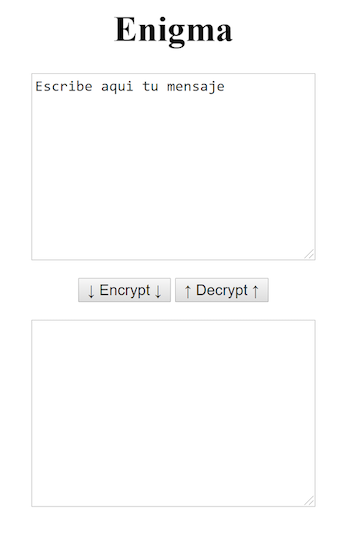

# Module 6 - Algorithms II - Laboratory

## Enigma

In cryptography, one of the easiest ways to encode messages is to substitute or replace letters with different ones.

For example, given the following sentence:
> 
> 
> hello friend

We could replace the letter 'a' with an 's', the 'o' with a 'z' and the 'm' with the symbol '*'. The sentence would remain:
> 
> 
> hzls s*igz

In this example, the transformation suffered could be expressed as

- a =&gt; s
- o =&gt; z
- m =&gt; *

In code we could express it as:

    var plainAlphabet = "aom";
    var encryptedAlphabet = "sz*";

Where each letter is related to its transformed letter through the index or position it occupies in the string.

We are going to implement a message encrypter / decrypter using this technique.

### Interface

- It uses two 'text' elements, one that will contain the message in clear and another with the message encrypted.
- Also add 2 buttons, one for encryption and one for decryption.

A simple example could be the following:

 

### Algorithm

The encryption algorithm is simple. The transformation that we are going to apply to each letter is going to be given by

    var plainAlphabet = "abcdefghijklmnopqrstuvwxyz:()!¡,'";
    var encryptedAlphabet = "qw,ert(yuio'pa:sdfg!hjklz¡xcv)bnm";

So:

- a' will be encrypted as 'q
- b' will be encrypted as 'w
- c' will be encrypted as ','
- and so on

It also implements decryption, which is exactly the same but applying the transformation in reverse:

- q' will be decrypted as 'a
- w' will be decrypted as 'b
- etc

This way, when the user enters a clear text and clicks on 'Encrypt', the message should be encrypted and displayed in the 'textarea' below. If you enter an encrypted message and press 'Decrypt', the message should be decrypted and displayed in the upper 'text box'.

### Test

Could you decipher the following message?
> 
> 
> b': yqg ,:agr(hue:) shrerg jq,u'qf q !hg ,:psqñrf:g rg,fuwurae: s:f r' ,yq!x mbg:z 'q 'r,yrn !hfua( t'usqfuq ,:apu(:)m z q ,:a!uahq,u:a rajuq ha pragqir ,utfqe:n br' dhr !h dhurfqg)

### Optional

It simplifies the previous algorithm thanks to the following information:

Strings are iterable and behave similarly to an array. They have methods that help us to search for elements. One of these methods that can be very useful is 'indexOf()`. This method returns the first index (in base 0) found for a given character, or what is the same, the position of the first occurrence of that character. That is, this method makes an iteration by the string looking for the character that you have provided, and as soon as it finds it, it returns the position of this character inside the array. Example:

    var myString = "house";
    myString.indexOf("a"); // 1

## Random generator

We are going to build a random generator that allows you to choose, at random, a certain amount of numbers from a minimum and a maximum. To understand it better, we will give you the signature that the function should have:

    var randomPick = (n, min, max) => {
      ...
    }

Thus, to choose 10 random numbers between 1 and 100, we will use the previous function as follows:

    randomPick(10, 1, 100);

and it will return us an array with those numbers, for example:

    [24, 83, 2, 94, 84, 38, 23, 69, 16, 89];

IMPORTANT: The numbers chosen at random should not be repeated.

This kind of flexible generator is very useful for a wide range of problems, for example:

    randomPick(6, 1, 49); // Automatic betting of the primitive
    randomPick(15, 1, 15); // Choose pool ball combination
    randomPick(1, 1, 6); // Random roll of a die

For this exercise you don't need to build a UI, it simply displays the result by console.
