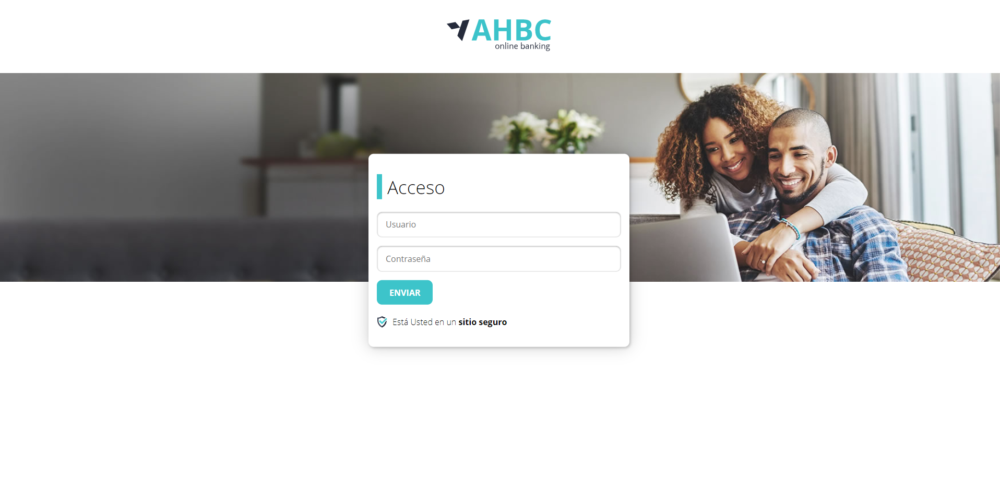
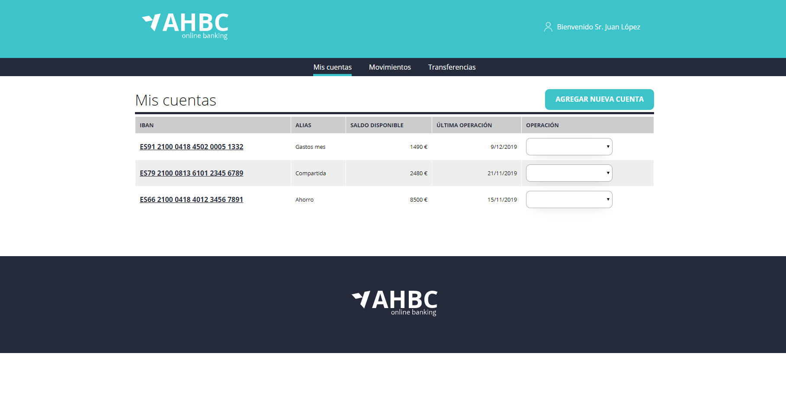
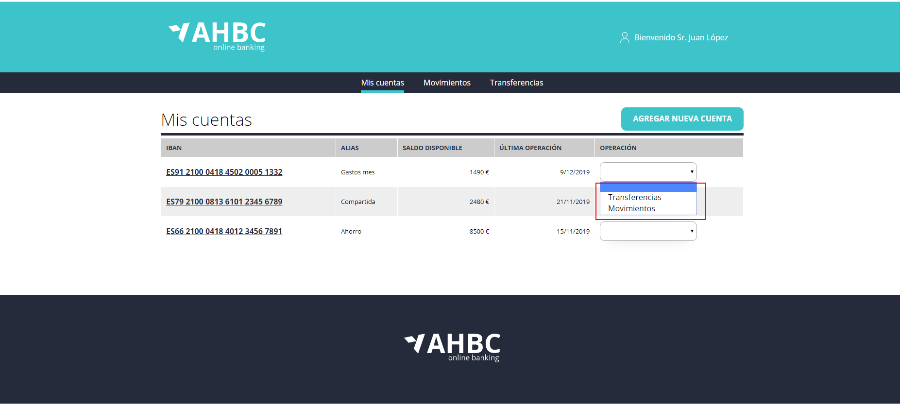
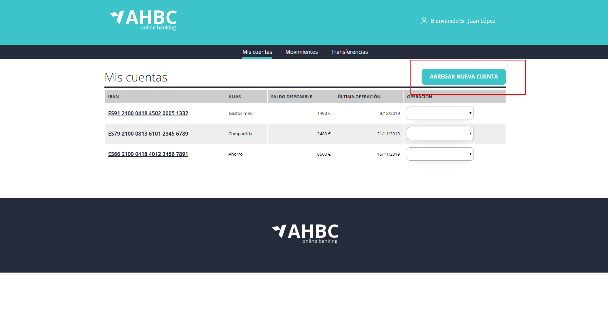
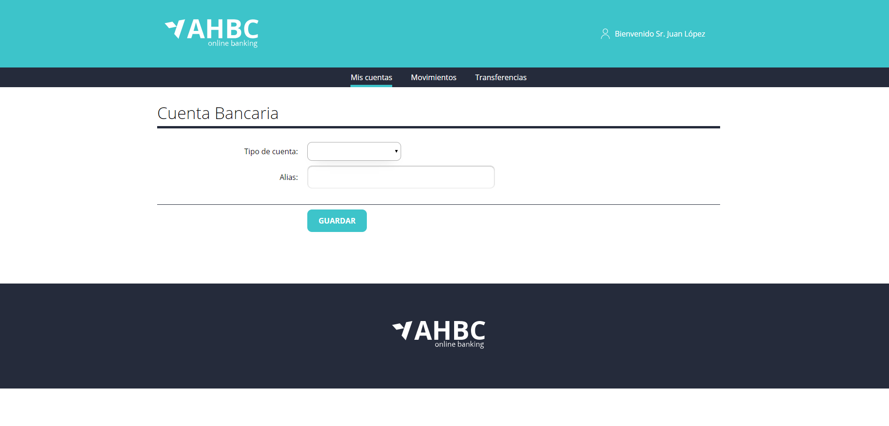
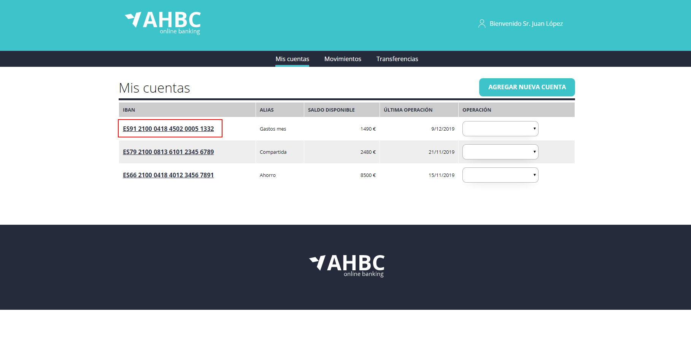
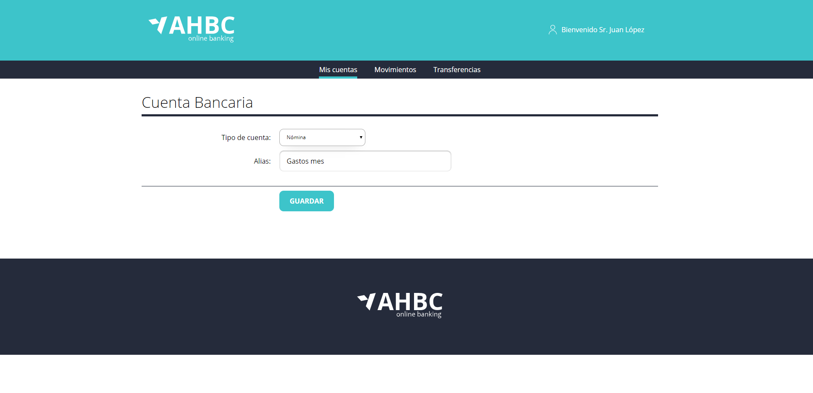
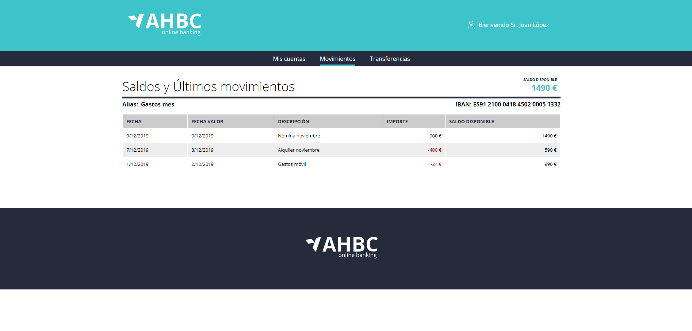
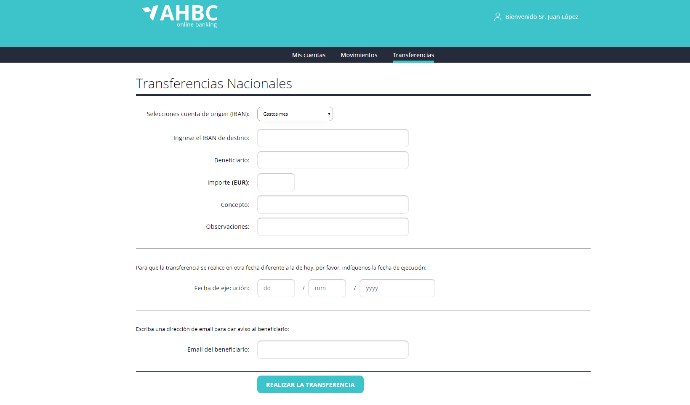

# Module 12 - Online Banking Case Study - Laboratory

In this module we will work with a more complete application. We will simulate an online banking portal, where we will show a list of account movements, as well as a bank transfer form.

## Application

This application therefore consists of several pages that we will be implementing little by little.

### Login

Here we will have the main page to access our application or login page.

On this page we will implement:

- Collect the values of the form.
- Add validations to the fields.
- Send the information to the server using an API method.
- Depending on whether the login is valid we will show an error message (if it has failed) or we will navigate to the next page (account list).

### List of accounts

Page with the available accounts of the logged in user.

On this page we will implement:

- Recover the available server accounts.
- Navigate to the transfer or movement page of a selected account.
- Navigate to new account creation

### Account

Page to create or edit account

On this page we will implement:

- Collect the values of the form.
- Add validations to the fields.
- Send the information to the server using an API method.
- Collect parameters from the url to see if it is create or edit mode.

### Movements

Page to consult the movements of an account.

- Collect parameters from the url to see the account id.
- Retrieve the available movements of that account.

### Transference
Page to send a transfer.

- Collect parameters from the url to see the account id.
- Collect form values.
- Add validations to the fields.
- Send the information to the server using an API method.
