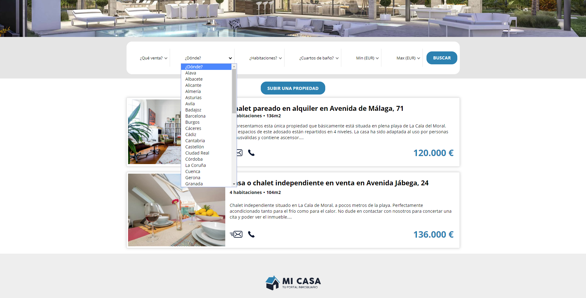
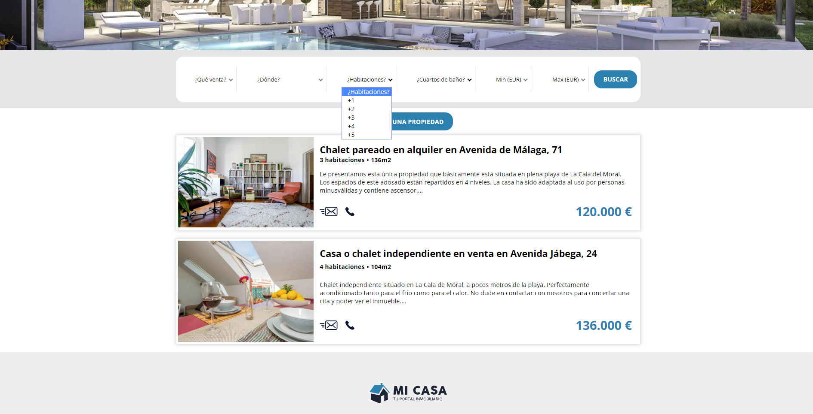
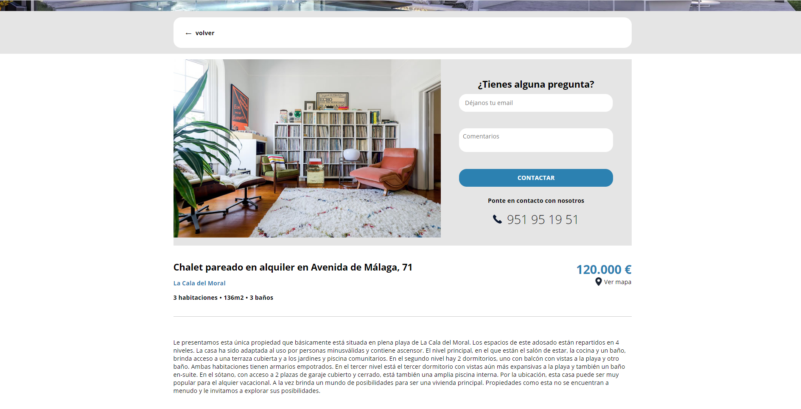
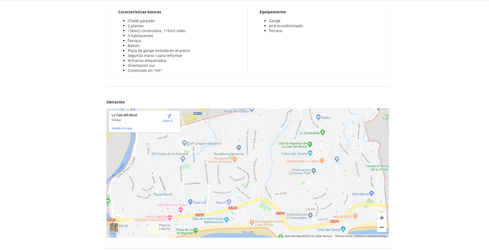
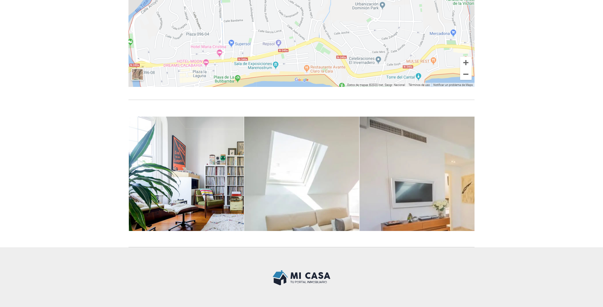
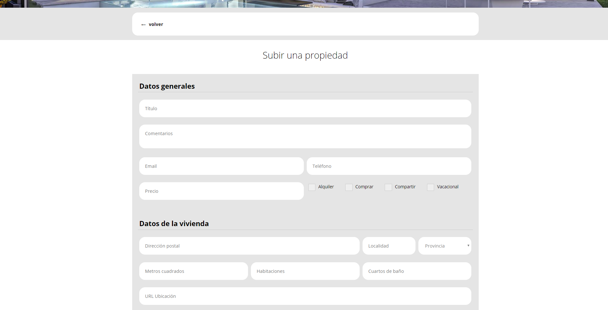
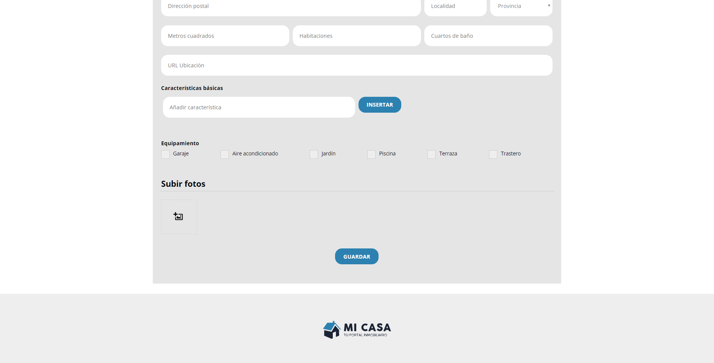
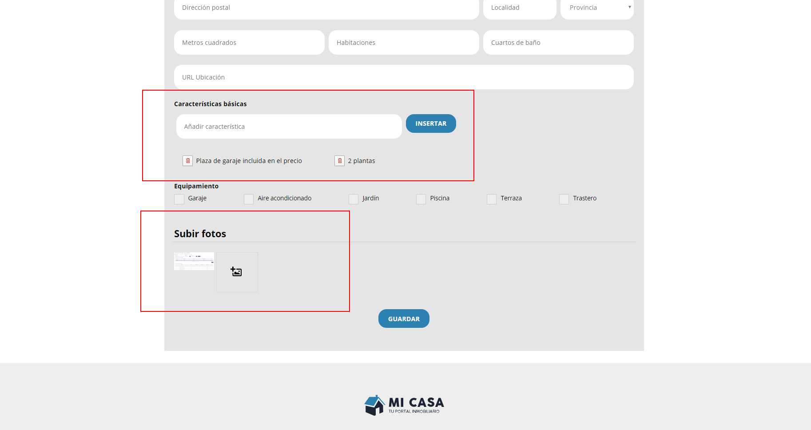

# Module 12 - Case Study Real Estate Portal - Laboratory

In this module we will work with another application different from the previous one. We are going to simulate a real estate portal, where we will show a list of properties, filter by a series of fields, show the detail and upload a new one.

# Application
This application therefore consists of several pages that we will be implementing little by little.

## Property listings

Page with the available properties according to the filter.

On this page we will implement:

- Recover the available server properties.
- Create `mapper` to comply with the view model.
- Retrieve server master data to load it into the filter.
- Create customer master data to load in the filter.
- Collect filter values.
- Use filter to filter on server.

## Property detail

Page to visualize the detail of a property.

On this page we will implement:

- Recover the server property according to the url id.
- Create `mapper` to comply with the view model.
- Recover the values of the contact form.
- Create necessary validations of the form.
- Create post method to send contact information.

The signature that would have a `PropertyDetail` as a model of the view would be

    PropertyDetail {
      id,
      title,
      notes,
      price
      city
      squareMeter
      rooms
      bathrooms
      locationUrl
      mainFeatures
      equipments
      mainImage
      images
    }

## Upload a new property
Page with the form to upload a new property.

On this page we will implement:

- Retrieve the values from the 'General Data' form.
- Create necessary validations of that form.
- Recover the values of the 'Housing data' form.
- Create necessary validations of this form.
- Recover the values of the "Upload photos" form.
- Create the "map" to comply with the api model.
- Create post method to send information from the form.

> Suggestion:
> 
> You can use the validators [fonk-array-required-validator](https://github.com/Lemoncode/fonk-array-required-validator) to make an array required and [fonk-is-url-validator](https://github.com/Lemoncode/fonk-is-url-validator) to validate an url.